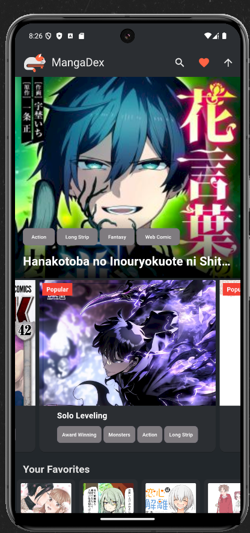
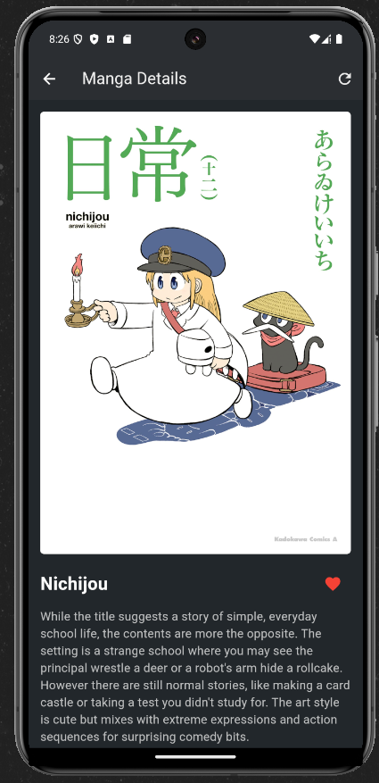
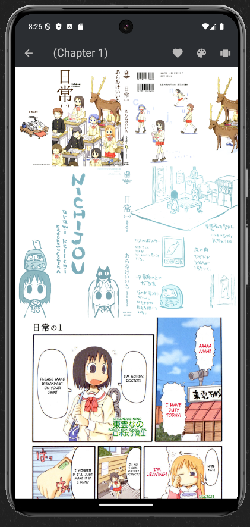

# MangaDexGetter

This app *Flutter APP* uses the public API from MangaDex to show free mangas.

# 

This is actually my Last school Project that i made with help from CopilotAI. For The Complete *OLD Commit* History Check Here 

https://github.com/SpiNoice01/PPB_Fadhila_Agil_Permana_2211104006_SE601/tree/main/TUBES/MangaDexGet